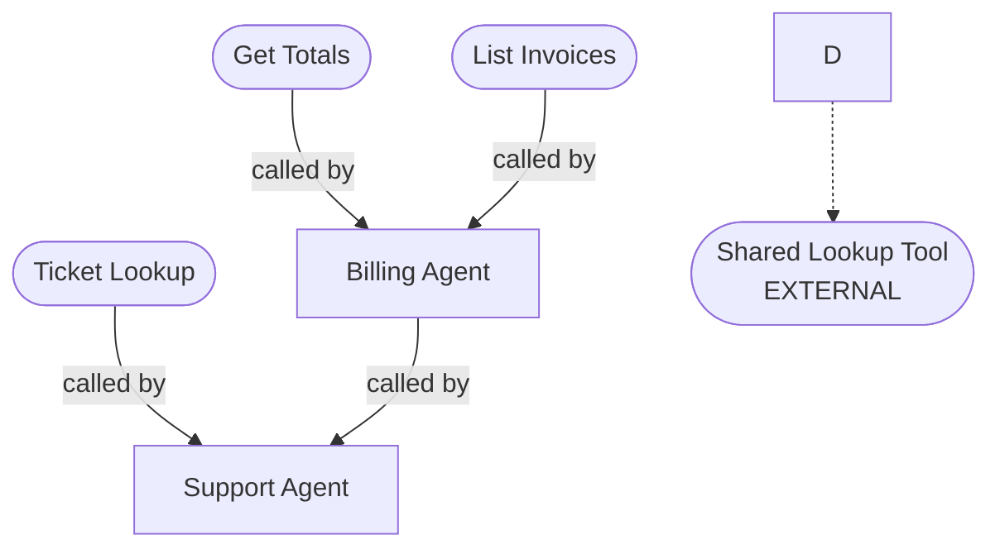
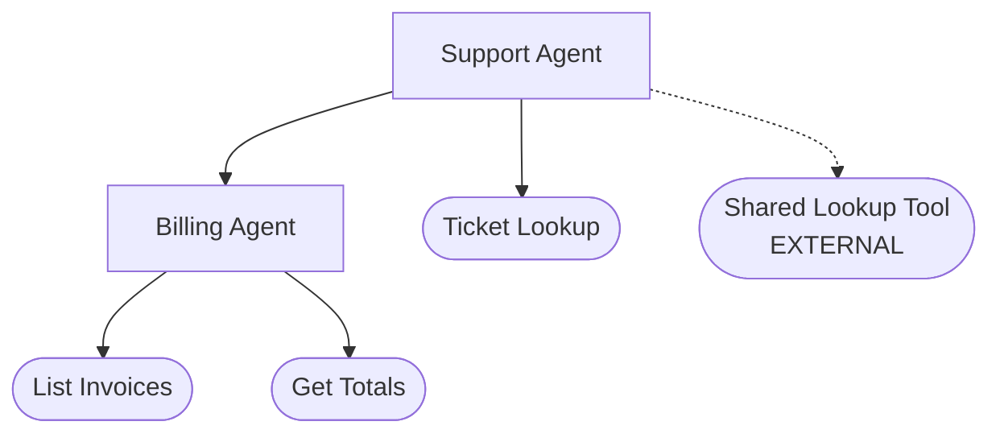

Discovery engine that finds, graphs, and registers all workflows in an n8n project. Reads configuration created by the getting-started wizard -- does not create config or ask setup questions.

## When to Use

- Automatically after the getting-started wizard (Options 1 or 2)
- User says "import my project", "discover workflows", "pull my workflows"
- `n8n-sdlc/config/project.json` already exists with `n8nProjectId` set

## Prerequisites

- `n8n-sdlc/config/project.json` must exist with `n8nProjectId` set. If missing, tell the user: **"Run the get-started skill first to set up your project."**
- n8n MCP server must be available

## Step 1: Load Configuration

Read `n8n-sdlc/config/project.json` to get:

- `n8nProjectId` (required -- locks all MCP operations to this project)
- `discoveryMode` (`"master"` or `"full-project"`)
- `masterWorkflowId` (only when `discoveryMode` is `"master"`)
- `workflowsDir` (base path for local files)
- `folderStrategy` (how to organize files)
- `naming.devPrefix` (for later DEV slot naming)

Read `n8n-sdlc/config/id-mappings.json` to check for any existing registrations.

If `discoveryMode` is not set in config (e.g., user invoked n8n-sdlc-import-project directly with existing config), ask:

```
How would you like to discover your workflows?

1. Start from a master workflow -- I'll follow all workflow references
   recursively to build the complete dependency tree.

2. Pull all workflows in the project -- I'll list everything in
   your n8n project and build the dependency graph from there.
```

If the user picks master and `masterWorkflowId` is not in config, ask for the workflow name or ID.

## Step 2: Discover Workflows

### Mode A: Master Workflow Traversal

Best when there is a clear entry-point workflow (an agent that calls sub-agents and tools).

1. Fetch the master workflow via MCP:

   ```
   MCP Tool: n8n_get_workflow
   Parameters:
     - id: {masterWorkflowId from config}
     - mode: "full"
   ```

2. Verify `shared[0].projectId` matches `n8nProjectId`. If not, reject.
3. Add to the discovered set
4. Scan all nodes for workflowId references (see Step 3)
5. For each referenced workflow, recursively fetch and scan

### Mode B: Full Project Pull

Best when there are multiple independent workflows or no clear hierarchy.

1. List all workflows in the project:

   ```
   MCP Tool: n8n_list_workflows
   Parameters:
     - projectId: {n8nProjectId}
     - limit: 100
   ```

   Handle pagination with `hasMore`/`nextCursor` if needed.

2. For each workflow in the list, fetch full details:

   ```
   MCP Tool: n8n_get_workflow
   Parameters:
     - id: {workflow ID}
     - mode: "full"
   ```

3. Add each to the discovered set
4. Scan all nodes for workflowId references (see Step 3)

## Step 3: Scan for Workflow References

For each discovered workflow, scan its nodes for references to other workflows:

```
Search nodes for:
- type: "@n8n/n8n-nodes-langchain.toolWorkflow"
- type: "n8n-nodes-base.executeWorkflow"

Extract each node.parameters.workflowId.value
```

For each referenced workflow ID:

1. **Already in discovered set?** Skip (already processed)
2. **Fetch via MCP:**

   ```
   MCP Tool: n8n_get_workflow
   Parameters:
     - id: {referenced workflow ID}
     - mode: "full"
   ```

3. **Check project ownership:** Compare `shared[0].projectId` to `n8nProjectId`
   - **Matches (in-project):** Add to discovered set, recurse into it
   - **Does not match (external):** Add to external dependencies list, do NOT recurse
   - **Workflow not found (deleted or inaccessible):** Warn user, add to issues list

Continue until no new workflows are discovered (all references resolved).

## Step 4: Build Dependency Graph

After discovery, build the complete graph:

```
For each discovered workflow:
  - List which workflows it calls (children)
  - List which workflows call it (parents)
  - Count how many parents reference it (for shared vs dedicated classification)
  - Check if it contains any @n8n/n8n-nodes-langchain.* nodes (agent vs tool)
```

Classify each workflow:

- **Agent**: Contains any `@n8n/n8n-nodes-langchain.agent`, `@n8n/n8n-nodes-langchain.chainLlm`, or similar AI nodes
- **Tool**: No AI nodes (plain automation workflow)

Determine hierarchy:

- **Top-level**: Not called by any other in-project workflow (0 parents)
- **Sub-agent**: Is an agent AND is called by another agent
- **Shared tool**: Called by 2+ workflows
- **Dedicated tool**: Called by exactly 1 workflow

## Step 5: Present Discovery Results

Show the user what was found:

```
DISCOVERY RESULTS
===========================================================

Project: {projectName}
n8n Project ID: {n8nProjectId}
Discovery mode: {Master workflow / Full project}

IN-PROJECT WORKFLOWS ({count}):
-----------------------------------------------------------
  Agents:
    Support Agent (top-level, entry point)
      -> calls: Billing Agent, Ticket Lookup, Shared Lookup Tool [external]
    Billing Agent (sub-agent, called by Support Agent)
      -> calls: List Invoices, Get Totals

  Tools:
    Ticket Lookup (dedicated to Support Agent)
    List Invoices (dedicated to Billing Agent)
    Get Totals (shared: Billing Agent, Reporting Agent)

EXTERNAL DEPENDENCIES ({count}):
-----------------------------------------------------------
  Shared Lookup Tool (ID: extId123)
    Referenced by: Support Agent
    Project: {different projectId}
    NOTE: Not managed by this SDLC. Same ID in DEV and PROD.

DEPENDENCY TREE:
-----------------------------------------------------------
  Support Agent
  ├── Billing Agent [agent]
  │   ├── List Invoices [tool]
  │   └── Get Totals [tool, shared]
  ├── Ticket Lookup [tool]
  └── Shared Lookup Tool [EXTERNAL]
```

## Step 6: Assign Local Paths

Read `folderStrategy` and `workflowsDir` from config. All paths are prefixed with `workflowsDir` if set.

**Flat strategy:**

| Classification | localPath |
|---------------|-----------|
| Any agent | `{workflowsDir}agents/` |
| Any tool | `{workflowsDir}tools/` |

**Categorized strategy:**

| Classification | localPath |
|---------------|-----------|
| Top-level agent | `{workflowsDir}agents/` |
| Sub-agent | `{workflowsDir}agents/agents/` |
| Shared tool | `{workflowsDir}tools/` |
| Dedicated tool (flat) | `{workflowsDir}tools/` |
| Dedicated tool (grouped) | `{workflowsDir}tools/{parent-name}/` |
| Dedicated tool (alongside) | Same as parent's `localPath` |

Create any necessary directories.

## Step 7: Register Workflows as PROD

All discovered in-project workflows are registered as PROD entries (they are the existing production workflows):

```json
{
  "workflows": {
    "Support Agent": {
      "type": "agent",
      "localPath": "agents/",
      "dev": {
        "id": null,
        "status": "needs-slot"
      },
      "prod": {
        "id": "existingProdId",
        "status": "active"
      },
      "audit": {
        "lastLocalPull": "{ISO timestamp}"
      }
    }
  }
}
```

Register external dependencies:

```json
{
  "externalDependencies": {
    "Shared Lookup Tool": {
      "id": "extId123",
      "referencedBy": ["Support Agent"],
      "note": "Outside project. Not managed by SDLC."
    }
  }
}
```

Save the bottom-up seeding order (computed in Step 4) to `metadata.seedOrder`:

```json
{
  "metadata": {
    "seedOrder": ["Get Totals", "List Invoices", "Ticket Lookup", "Billing Agent", "Support Agent"]
  }
}
```

This avoids recomputing the dependency graph when the seed skill runs later. The seed skill will read this array directly.

## Step 8: Save Workflow JSON Files Locally

For each in-project workflow, save the fetched JSON to the assigned path:

```
{localPath}{workflow name}.json

Examples:
  agents/Support Agent.json
  agents/agents/Billing Agent.json
  tools/List Invoices.json
  tools/Support Agent/Ticket Lookup.json  (if grouped strategy)
```

## Step 9: Generate Dependency Diagram

Generate a Mermaid diagram from the dependency graph built in Step 4 and save it as a Markdown file.

### Build the Mermaid Source

1. **Assign node IDs** in `seedOrder` sequence (bottom-up: leaf tools first, top-level agents last). Use single letters A–Z, then two-letter IDs AA, AB, etc. for projects with more than 26 workflows.

2. **Choose node shapes by type:**
   - Agents: `A[Agent Name]` (rectangle)
   - Tools: `B([Tool Name])` (stadium/rounded)

3. **Draw edges from parent to child:**
   - In-project calls: solid arrow `A --> B`
   - External dependencies: dashed arrow with label `A -.-> X([Ext Name\nEXTERNAL])`

4. **Skip self-referencing edges** (a workflow calling itself).

5. **Use `graph TD`** (top-down) so entry-point agents appear at the top.

### Example Output

For a project with 2 agents, 3 tools, and 1 external dependency:

````text
# Workflow Connections

Auto-generated by n8n SDLC import. Do not edit manually — re-run import to regenerate.



**Legend:** `[Name]` = agent | `([Name])` = tool | solid arrow = in-project call | dashed arrow = external dependency
````

**Correction — use caller-to-callee direction** (more natural to read):

````text

````

Use the caller → callee direction (parent → child) so the graph reads naturally top-down.

### Save the Diagram

Save to `n8n-sdlc/diagrams/workflow-connections.md`:

```text
# Workflow Connections

> Auto-generated by n8n SDLC import. Do not edit manually — re-run import to regenerate.

{mermaid code block}

**Legend:** `[Name]` = agent | `([Name])` = tool | solid arrow = in-project call | dashed arrow = external dependency
```

Create the `n8n-sdlc/diagrams/` directory if it does not exist.

### Edge Cases

- **No connections** (single workflow with no sub-workflow calls): Generate diagram with just the one node
- **Circular references**: Render as-is — Mermaid handles cycles gracefully
- **Re-import**: Overwrite the existing diagram file with the latest graph

## Step 10: Generate Project README

After generating the diagram, create a project-focused `README.md` at the workspace root. This README describes the user's n8n project -- not the SDLC framework. All the data needed is already available from discovery (Steps 2-4) and the diagram (Step 9).

### Ask for a project description

```text
I'd like to generate a README for your project repository.

Can you give me a one-line description of what this project does?
(e.g., "AI agent that handles tech support requests in Slack")

Or type "skip" to use a generic description.
```

If the user skips, use: `n8n workflow project managed with n8n-sdlc.`

### README structure

Generate `README.md` at the workspace root with these sections. Use data already collected during import -- no additional MCP calls needed.

**Line 1 -- marker comment:** `<!-- n8n-sdlc:readme -->` (allows re-import to detect and replace).

**Section 1 -- Header:**

```text
# {projectName or logical name of top-level agent}

{User-provided description or generic fallback}

- **n8n Project ID:** `{n8nProjectId}`
- **Entry point:** {top-level workflow name(s) -- 0-parent workflows from Step 4}
- **Managed with:** [n8n-sdlc](https://github.com/mgdpax8/n8n-sdlc) v{version from n8n-sdlc/VERSION}
```

**Section 2 -- Architecture (embedded Mermaid diagram):**

Copy the same `graph TD` block generated in Step 9 directly into the README inside a mermaid code fence. Include the legend line beneath it.

**Section 3 -- Workflows table:**

```text
| Workflow | Type | Role | PROD ID |
|----------|------|------|---------|
| {name} | {agent/tool} | {top-level/sub-agent/shared tool/dedicated tool} | `{prod.id}` |
```

One row per workflow from id-mappings.workflows.

**Section 4 -- External Dependencies (omit if none):**

```text
| Workflow | ID | Referenced By |
|----------|-----|---------------|
| {name} | `{id}` | {referencedBy joined with ", "} |
```

**Section 5 -- Integrations (best-effort, omit if none detected):**

Scan the discovered workflow nodes for recognizable integration patterns:

- Node types containing service names (slack, servicenow, jira, github, etc.)
- Credential type names (often indicate the service)
- HTTP Request nodes with URLs containing known service domains

```text
| Service | Used By | How |
|---------|---------|-----|
| {service} | {workflow names} | {node type or brief description} |
```

If no recognizable integrations are detected, omit this section entirely.

**Section 6 -- Development quick reference:**

```text
## Development

This project uses [n8n-sdlc](https://github.com/mgdpax8/n8n-sdlc) for dev/prod workflow management.

### Quick reference

| Action | Command |
|--------|---------|
| Pull latest from n8n | `n8n-pull-workflow {name}` |
| Push changes to DEV | `n8n-push-workflow {name}` |
| Promote to PROD | `n8n-promote-workflow {name}` |
| Check project health | `n8n-doctor` |
| View status dashboard | `n8n-project-status` |

### Branch model

| Branch | Purpose |
|--------|---------|
| `{git.devBranch}` | Active development |
| `{git.mainBranch}` | Mirrors production |

See `n8n-sdlc/docs/` for full SDLC documentation.
```

### Handling existing README

- **No `README.md` exists:** Create it.
- **`README.md` exists and starts with `<!-- n8n-sdlc:readme -->`:** Replace it (re-import).
- **`README.md` exists without the marker:** Ask before overwriting:

  ```text
  A README.md already exists. Would you like me to:
  1. Replace it with the generated project README
  2. Keep the existing README (skip generation)
  ```

### Notes

- The `<!-- n8n-sdlc:readme -->` marker on line 1 allows re-import to detect and replace it automatically.
- The Mermaid diagram is embedded directly -- the separate `workflow-connections.md` is still generated for standalone use.
- The Integrations section is best-effort. Omit rather than show an empty table.
- The README should answer three questions for someone seeing the repo for the first time: "what is this?", "what does it contain?", and "how do I work on it?"

## Step 11: Create DEV Slots

After registering all workflows as PROD, check `n8n-sdlc/config/project.json` for `slotCreator.webhookUrl`.

### If Slot Creator is configured

Offer to auto-create DEV slots immediately:

```
NEXT STEP: DEV Slot Creation
===========================================================

You have {N} production workflows registered. I can auto-create
{N} DEV slots using the Slot Creator.

Shall I create and claim {N} DEV slots now? (yes/no)

DEV workflows to create:
  - DEV-Support Agent
  - DEV-Billing Agent
  - DEV-List Invoices
  - DEV-Ticket Lookup
  - DEV-Get Totals
```

If the user says **yes**: invoke the reserve skill logic directly in handoff mode. The reserve skill will read `id-mappings.json` for all `dev.status: "needs-slot"` entries and use the Slot Creator webhook to create and claim them.

If the user says **no** or **later**: show the manual instructions below and let the user run "reserve workflows" when ready.

### If Slot Creator is NOT configured

Show manual instructions:

```
NEXT STEP: DEV Slot Creation
===========================================================

You have {N} production workflows registered. To enable the
DEV/PROD workflow, you need {N} empty DEV slots.

Say "reserve workflows" and I'll walk you through creating
and claiming them.

DEV workflows needed:
  - DEV-Support Agent
  - DEV-Billing Agent
  - DEV-List Invoices
  - DEV-Ticket Lookup
  - DEV-Get Totals

TIP: Set up the Slot Creator helper workflow to automate this
step. See n8n-sdlc/helpers/README.md for instructions.
```

### In both cases, include the recommended seeding order

```
RECOMMENDED SEEDING ORDER (bottom-up):
  1. Get Totals, List Invoices, Ticket Lookup (leaf tools)
  2. Billing Agent (sub-agent)
  3. Support Agent (top-level agent)

Seeding bottom-up ensures DEV tool references are available
when seeding the agents that call them.
```

## Step 12: Git Sync

After saving all workflow files and the diagram, run the **n8n-sdlc-git-sync** skill with:

- Files: all saved workflow JSONs, `n8n-sdlc/config/id-mappings.json`, `n8n-sdlc/config/project.json`, `n8n-sdlc/diagrams/workflow-connections.md`, `README.md`
- Message: `[import] Initial import: {N} workflows discovered`
- Example: `[import] Initial import: 5 workflows discovered`

This creates the first commit in the project repo with the full baseline.

## Error Handling

| Error | Resolution |
|-------|------------|
| project.json missing | Run the get-started skill first |
| n8nProjectId not set | Run the get-started skill to configure |
| MCP not available | Cannot discover; check MCP connection |
| Workflow not found | May have been deleted; skip and warn |
| Master workflow not in project | Verify the ID and project settings |
| Pagination needed | Follow nextCursor for full listing |
| Existing registrations | Warn about conflicts; ask to overwrite or skip |

## MCP Commands Used

- `n8n_list_workflows` - List all workflows in project (Mode B; always pass `projectId`)
- `n8n_get_workflow` - Fetch full workflow for scanning (mode: "full")

## What This Skill Does NOT Do

- Does NOT create config files (get-started does that)
- Does NOT ask about storage location or folder strategy (get-started does that)
- Does NOT create DEV workflows (use n8n-sdlc-reserve-workflows + n8n-sdlc-seed-dev)
- Does NOT modify any workflows in n8n (read-only discovery)
- Does NOT pull or manage external dependencies
- Does NOT activate or deactivate workflows

## Related Skills

- **n8n-sdlc-getting-started** - Run before this to create config (the wizard)
- **n8n-sdlc-reserve-workflows** - Run after this to claim DEV slots
- **n8n-sdlc-seed-dev** - Run after reserving to populate DEV from PROD
- **n8n-sdlc-git-sync** - Called automatically after import to commit the baseline
- **n8n-sdlc-project-status** - View the state after import
